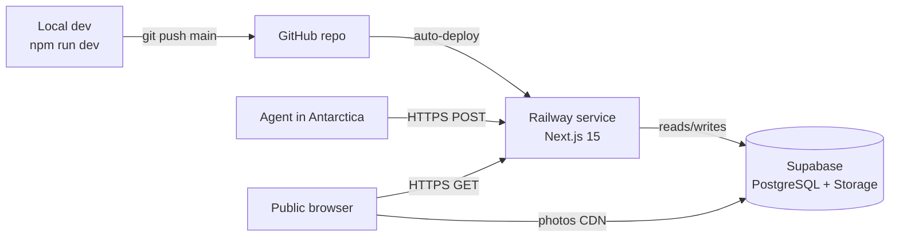

# AITARTICA Web — Expedition Tracking Platform


## Overview

Full-stack platform that receives real-time expedition data from an AI agent operating aboard a ship in Antarctica. The agent communicates over satellite, POSTing GPS routes, weather snapshots, photos, daily reflections, navigation analyses, short dispatches, and running expedition totals. The server stores everything in Supabase (PostgreSQL + Storage) and serves a public-facing website that visualizes the expedition live.

## Architecture

- **Single Next.js 15 app**: API routes handle all inbound agent POSTs; App Router pages serve the public frontend. One repo, one Railway service.
- **Bearer token auth**: All `/api/*` POST endpoints require `Authorization: Bearer <REMOTE_SYNC_API_KEY>`. Validated in Next.js middleware before any route handler runs.
- **Supabase PostgreSQL**: Stores all structured data (track, weather, reflections, messages, progress, route analyses, photo metadata).
- **Supabase Storage + CDN**: JPEG photos uploaded by the agent are stored in a `photos` bucket, served via Supabase's built-in Cloudflare CDN. No extra CDN config needed.
- **Upsert semantics for singletons**: `/api/track` and `/api/progress` always overwrite — one canonical row. All others append new rows.
- **No direct DB access from browser**: All data fetching is server-side (Server Components or API routes). Browser only touches Supabase CDN for photo URLs.

## Request Flow


## Project Structure

```
aitartica-web/
├── app/
│   ├── api/
│   │   ├── track/route.ts          # POST — GPS route upsert
│   │   ├── weather/route.ts        # POST — weather snapshot
│   │   ├── photos/route.ts         # POST — photo upload (multipart)
│   │   ├── reflections/route.ts    # POST — daily reflection upsert
│   │   ├── route-analysis/route.ts # POST — navigation snapshot
│   │   ├── messages/route.ts       # POST — agent dispatch
│   │   └── progress/route.ts       # POST — expedition totals upsert
│   ├── layout.tsx
│   └── page.tsx                    # Frontend (later)
├── lib/
│   ├── supabase.ts                 # Supabase client (server-side)
│   └── auth.ts                     # Bearer token validation helper
├── middleware.ts                    # Auth guard for /api/* POST routes
├── supabase/
│   └── schema.sql                  # Full DB schema (run once in Supabase dashboard)
├── .env.local                      # SUPABASE_URL, SUPABASE_SERVICE_KEY, REMOTE_SYNC_API_KEY
├── NOTES.md
├── PLAN.md
└── package.json
```

## Key Design Decisions

### Single Next.js app (no separate backend service)
All API endpoints live as Next.js App Router route handlers. This means one Railway service, one deploy, shared env vars, and no cross-origin complexity. For the request volume of a satellite-connected agent (a few POSTs per hour), this is more than sufficient.

### Supabase over raw Railway PostgreSQL
Supabase gives us PostgreSQL + file storage + CDN in one platform with a generous free tier (1GB storage, 500MB DB). The agent uploads ~240 photos over 12 days (~480MB) — well within limits. The Supabase JS client simplifies both DB queries and storage uploads.

### Bearer token in middleware (not per-route)
`middleware.ts` intercepts all `/api/*` requests and validates the `Authorization` header before any route handler executes. This keeps auth logic in one place and prevents accidental exposure of unprotected endpoints.

### Upsert for singletons (track + progress)
The agent sends the full GPS route and full expedition totals on every sync — not deltas. The server upserts a single canonical row for each, so the frontend always reads the latest complete snapshot without accumulating stale partial rows.

### Multipart photo uploads via native Web API
Next.js 15 App Router natively supports `request.formData()` for multipart — no `formidable` or `busboy` needed. The JPEG is streamed directly to Supabase Storage; only metadata goes to the DB.

### Service role key for server-side Supabase
All API routes use the Supabase `service_role` key (never exposed to the browser). This bypasses Row Level Security for server-to-server writes. Public GET routes (if added later) use the `anon` key.

## Infrastructure

### Railway
- **Service**: Single Next.js app (web service). Auto-deploy from GitHub `main` branch.
- **Config**: `railway.toml` — build `npm run build`, start `npm run start`, healthcheck `/`.
- **No Railway PostgreSQL plugin** — DB is fully managed by Supabase.
- **Status**: Pending — needs GitHub repo connected + env vars set in dashboard.

### Supabase
- **Plan**: Free tier (sufficient for expedition scope).
- **PostgreSQL**: 7 tables applied ✅. RLS disabled (service role bypasses it).
- **Storage bucket**: `photos` (public) ✅ — Cloudflare CDN at `*.supabase.co/storage/v1/object/public/photos/...`.
- **Status**: ✅ Live and tested.

### Deployment Flow



### Environment Variables

| Variable | Where set | Used for |
|---|---|---|
| `SUPABASE_URL` | `.env` ✅ + Railway ⏳ | Supabase client init |
| `SUPABASE_ANON_KEY` | `.env` ✅ + Railway ⏳ | Legacy JWT anon key |
| `SUPABASE_SERVICE_ROLE_KEY` | `.env` ✅ + Railway ⏳ | Server writes, bypasses RLS |
| `REMOTE_SYNC_API_KEY` | `.env` ✅ + Railway ⏳ | Agent Bearer token |

## Frontend — Data Wiring

| Section | Source | Status |
|---------|--------|--------|
| Trajectory Map | `gps_points` ASC, fallback to placeholder | ✅ Done |
| LAT/LON header | Last `gps_points` row, hidden when empty | ✅ Done |
| Mission Log | Today's `reflections` + `messages`, fallback to placeholder | ✅ Done |
| Photo Gallery | `photos` ordered by `significance_score` DESC, fallback to picsum | ✅ Done |

**Remaining UI work (post-deploy):**
- Photo Gallery day tabs (filter by day, derive available days from DB)
- Daily Reflection section wired to `reflections` (currently hardcoded)
- Stats: add `photos_captured_total` as 6th stat from `progress`
- HEADING in map overlay: wire to last `route_analyses.bearing_compass`

---

## Commit History

| #   | Description                                                   | Status      |
|-----|---------------------------------------------------------------|-------------|
| 1   | Init Next.js 15 project + env setup                           | ✅ Done     |
| 2   | Supabase schema (all 7 tables + storage bucket)               | ✅ Done     |
| 3   | Supabase client + Bearer auth middleware                      | ✅ Done     |
| 4   | POST /api/track, /api/weather, /api/progress                  | ✅ Done     |
| 5   | POST /api/reflections, /api/messages                          | ✅ Done     |
| 6   | POST /api/route-analysis                                      | ✅ Done     |
| 7   | POST /api/photos (multipart + Storage upload)                 | ✅ Done     |
| 8   | backend.md — API reference for agent client                   | ✅ Done     |
| 9   | Public frontend — stats bar, map, mission log, photo gallery  | ✅ Done     |
| 10  | Wire map + LAT/LON to `gps_points`                            | ✅ Done     |
| 11  | Wire Mission Log to today's `reflections` + `messages`        | ✅ Done     |
| 12  | Wire Photo Gallery to `photos` from Supabase Storage          | ✅ Done     |
| 13  | Wire remaining UI: stats photos, HEADING, reflection, day tabs | ✅ Done     |
| 14  | Photo gallery lightbox + quote always visible                  | ✅ Done     |
| 15  | UI polish: stats bar 6-col, nav hamburger mobile, map/log layout | ✅ Done   |
| 16  | Railway deploy + env vars + end-to-end test                   | ⏳ Next     |

## Key Dates

- **Expedition start**: 2026-03-17 (Day 1). `expedition_day` in DB will be negative before this date — expected behavior.

## Railway Deploy

✅ Live at `https://aitartica.com` — SSL via Let's Encrypt, auto-deploy from `main`.

---

## Twitter / X Integration

### Goal
Auto-tweet from the expedition's X account every time the agent posts a **message** or a **photo**. Photos include the `agent_quote` if available.

### Auth model — OAuth 1.0a (user context)
The Bearer Token only allows read-only access. To post tweets as the agent's account we need OAuth 1.0a credentials:

| Credential | Env var | Status |
|---|---|---|
| Consumer Key | `TWITTER_CONSUMER_KEY` | ✅ Set |
| Consumer Secret | `TWITTER_CONSUMER_SECRET` | ✅ Set |
| Bearer Token | `TWITTER_BEARER_TOKEN` | ✅ Set |
| Access Token | `TWITTER_ACCESS_TOKEN` | ⏳ Pending OAuth flow |
| Access Token Secret | `TWITTER_ACCESS_TOKEN_SECRET` | ⏳ Pending OAuth flow |

### One-time OAuth setup (get Access Token + Secret)
1. In Twitter Developer Portal → App → "Keys and Tokens" → generate **Access Token & Secret** for the agent's account (must be logged in as that account)
2. Add `TWITTER_ACCESS_TOKEN` and `TWITTER_ACCESS_TOKEN_SECRET` to `.env` and Railway
3. Verify with a test tweet

> **Note:** The app must have **Read and Write** permissions in the Developer Portal (not Read-only). Check under App Settings → User authentication settings.

### Tweet triggers

| Trigger | Endpoint | Tweet format |
|---|---|---|
| New message | `POST /api/messages` | `{content}` (truncated to 280 chars) |
| New photo | `POST /api/photos` | `{agent_quote ?? vision_summary}` + photo attached via media upload |

### Implementation plan

```
lib/twitter.ts              # Twitter client — OAuth1 signing + tweet/uploadMedia helpers
app/api/messages/route.ts   # After DB insert → sendTweet(content)
app/api/photos/route.ts     # After Storage upload → uploadMedia(jpeg) → sendTweetWithMedia(quote, mediaId)
```

#### `lib/twitter.ts`
- Use `twitter-api-v2` npm package (handles OAuth 1.0a signing)
- Export `tweetText(text: string)` and `tweetPhoto(text: string, imageUrl: string)`
- Guard: if `TWITTER_ACCESS_TOKEN` is not set, skip silently (so local dev doesn't fail)
- Tweet failures must NOT fail the API response — wrap in try/catch, log error only

#### Tweet format examples
```
// Message
"The wind hasn't stopped for 48 hours. The AI suggests we move to sector 4,
but the visuals are completely white. #AITARTICA #Antarctica"

// Photo
"TWO SOULS, ONE OCEAN. 🐋
📍 64.1°S · Day -6 · #AITARTICA"
[attached: photo JPEG]
```

### Env vars to add to Railway after OAuth flow
```
TWITTER_ACCESS_TOKEN=<from developer portal>
TWITTER_ACCESS_TOKEN_SECRET=<from developer portal>
```

### Next steps
1. ⏳ Generate Access Token + Secret in Twitter Developer Portal (agent account)
2. ⏳ Implement `lib/twitter.ts` with `twitter-api-v2`
3. ⏳ Wire into `/api/messages` and `/api/photos`
4. ⏳ End-to-end test: POST message → confirm tweet appears on agent's timeline
