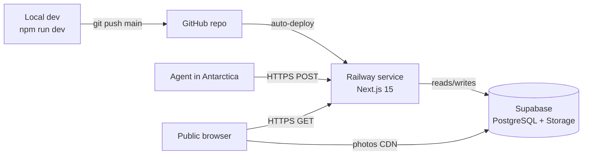

# Antartia Web — Expedition Tracking Platform

## Overview

Full-stack platform that receives real-time expedition data from an AI agent operating aboard a ship in Antarctica. The agent communicates over satellite, POSTing GPS routes, weather snapshots, photos, daily reflections, navigation analyses, short dispatches, and running expedition totals. The server stores everything in Supabase (PostgreSQL + Storage) and serves a public-facing website that visualizes the expedition live.

## Architecture

- **Single Next.js 15 app**: API routes handle all inbound agent POSTs; App Router pages serve the public frontend. One repo, one Railway service.
- **Bearer token auth**: All `/api/*` POST endpoints require `Authorization: Bearer <REMOTE_SYNC_API_KEY>`. Validated in Next.js middleware before any route handler runs.
- **Supabase PostgreSQL**: Stores all structured data (track, weather, reflections, messages, progress, route analyses, photo metadata).
- **Supabase Storage + CDN**: JPEG photos uploaded by the agent are stored in a `photos` bucket, served via Supabase's built-in Cloudflare CDN. No extra CDN config needed.
- **Upsert semantics for singletons**: `/api/track` and `/api/progress` always overwrite — one canonical row. All others append new rows.
- **Public GET endpoints**: Frontend fetches data via internal Next.js server components or public GET API routes. No auth required for reads.

## Request Flow


## Project Structure

```
aitartica-web/
├── app/
│   ├── api/
│   │   ├── track/route.ts          # POST — GPS route upsert
│   │   ├── weather/route.ts        # POST — weather snapshot
│   │   ├── photos/route.ts         # POST — photo upload (multipart)
│   │   ├── reflections/route.ts    # POST — daily reflection upsert
│   │   ├── route-analysis/route.ts # POST — navigation snapshot
│   │   ├── messages/route.ts       # POST — agent dispatch
│   │   └── progress/route.ts       # POST — expedition totals upsert
│   ├── layout.tsx
│   └── page.tsx                    # Frontend (later)
├── lib/
│   ├── supabase.ts                 # Supabase client (server-side)
│   └── auth.ts                     # Bearer token validation helper
├── middleware.ts                    # Auth guard for /api/* POST routes
├── supabase/
│   └── schema.sql                  # Full DB schema (run once in Supabase dashboard)
├── .env.local                      # SUPABASE_URL, SUPABASE_SERVICE_KEY, REMOTE_SYNC_API_KEY
├── NOTES.md
├── PLAN.md
└── package.json
```

## Key Design Decisions

### Single Next.js app (no separate backend service)
All API endpoints live as Next.js App Router route handlers. This means one Railway service, one deploy, shared env vars, and no cross-origin complexity. For the request volume of a satellite-connected agent (a few POSTs per hour), this is more than sufficient.

### Supabase over raw Railway PostgreSQL
Supabase gives us PostgreSQL + file storage + CDN in one platform with a generous free tier (1GB storage, 500MB DB). The agent uploads ~240 photos over 12 days (~480MB) — well within limits. The Supabase JS client simplifies both DB queries and storage uploads.

### Bearer token in middleware (not per-route)
`middleware.ts` intercepts all `/api/*` requests and validates the `Authorization` header before any route handler executes. This keeps auth logic in one place and prevents accidental exposure of unprotected endpoints.

### Upsert for singletons (track + progress)
The agent sends the full GPS route and full expedition totals on every sync — not deltas. The server upserts a single canonical row for each, so the frontend always reads the latest complete snapshot without accumulating stale partial rows.

### Multipart photo uploads via native Web API
Next.js 15 App Router natively supports `request.formData()` for multipart — no `formidable` or `busboy` needed. The JPEG is streamed directly to Supabase Storage; only metadata goes to the DB.

### Service role key for server-side Supabase
All API routes use the Supabase `service_role` key (never exposed to the browser). This bypasses Row Level Security for server-to-server writes. Public GET routes (if added later) use the `anon` key.

## Infrastructure

### Railway
- **Service**: Single Next.js app (web service). Auto-deploy from GitHub `main` branch.
- **Region**: US West (closest to South America for satellite latency).
- **Plan**: Hobby ($5/mo) — covers always-on Node process + custom domain if needed.
- **Env vars set in Railway dashboard**: `SUPABASE_URL`, `SUPABASE_ANON_KEY`, `SUPABASE_SERVICE_ROLE_KEY`, `REMOTE_SYNC_API_KEY`, `NODE_ENV=production`.
- **No Railway PostgreSQL plugin** — DB is fully managed by Supabase.

### Supabase
- **Plan**: Free tier (sufficient for expedition scope).
- **PostgreSQL**: 7 tables (see schema). Direct connection via `SUPABASE_DATABASE_URL` only used for migrations if needed.
- **Storage bucket**: `photos` — public bucket, served via Cloudflare CDN edge (`*.supabase.co/storage/v1/object/public/photos/...`).
- **Auth**: Service role key on all server-side writes. Anon key reserved for future public read clients.
- **RLS**: Disabled on all tables (service role bypasses it). Can be enabled later for multi-tenancy.

### Deployment Flow



### Environment Variables

| Variable | Where set | Used for |
|---|---|---|
| `SUPABASE_URL` | `.env` + Railway | Supabase client init |
| `SUPABASE_ANON_KEY` | `.env` + Railway | `sb_publishable_...` — public read client |
| `SUPABASE_SERVICE_ROLE_KEY` | `.env` + Railway | `sb_secret_...` — server writes, bypasses RLS |
| `REMOTE_SYNC_API_KEY` | `.env` + Railway | Validates agent Bearer token |

## Commit History

| #   | Description                                      | Status      |
|-----|--------------------------------------------------|-------------|
| 1   | Init Next.js 15 project + env setup              | Done        |
| 2   | Supabase schema (all 7 tables + storage bucket)  | Done        |
| 3   | Supabase client + Bearer auth middleware         | Done        |
| 4   | POST /api/track, /api/weather, /api/progress     | Done        |
| 5   | POST /api/reflections, /api/messages             | Done        |
| 6   | POST /api/route-analysis                         | Done        |
| 7   | POST /api/photos (multipart + Storage upload)    | Done        |
| 8   | backend.md — API reference for agent client      | Done        |
| 9   | Deploy to Railway + env vars config              | Planned     |
